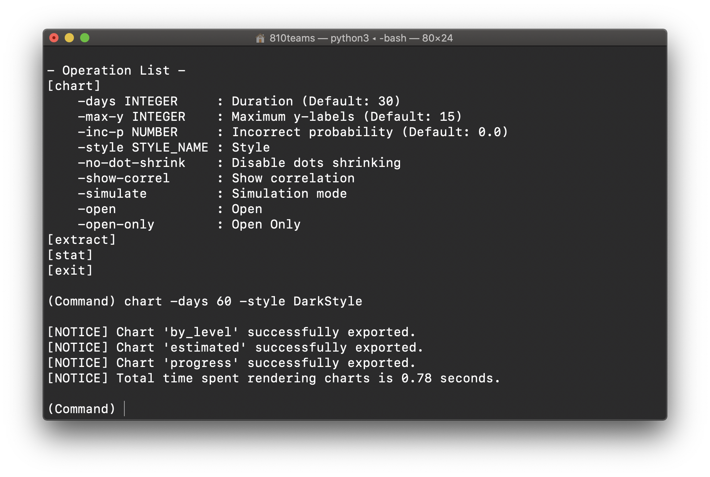
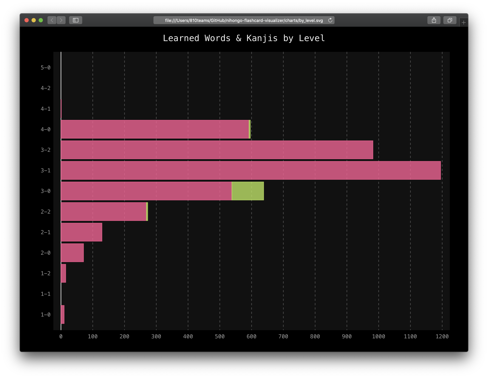

# Nihongo Flashcard Visualizer
Nihongo Japanese Dictionary Application Flashcard Progress Visualizer, or as Nihongo Flashcard Visualizer, the name of the repository.

This repository contains code of the command line application in rendering and visualizing charts of Nihongo flashcard progress.

## Nihongo Application
Nihongo is a Japanese dictionary and flashcard application available on iOS devices.

Download for iOS on [AppStore](https://apps.apple.com/us/app/nihongo-japanese-dictionary/id881697245) (Requires iOS 12.4 or later)

## System Requirements
Nihongo Flashcard Visualizer requires Python 3.6 or later, with Pygal library installed.

This application is not guaranteed to be able to run on Windows, works fine on MacOS Catalina (10.15).

### Install Python
Python can be installed from various sources. The following two are the most recommended (Choose one).

Download from [python.org](https://www.python.org/downloads/).

Download from [anaconda.com](https://www.anaconda.com/distribution/#download-section).

### Install Pygal
```shell
pip install pygal
```

## Manual
### Setting Up
Run `setup.sh` first. After setting up, run `run.sh` or use Python to run `main.py` to run the application.

### Requirements
This application requires your Nihongo backup file placed in the application folder, the file should be named as `NihongoBackup.nihongodata`, the default name.

### Extraction
Rendering charts requires `Flashcards.sqlite` to be extracted from your Nihongo backup file.

Extraction can be done by typing the command `extract` or simply `e` then hit enter/return key while the app is being runned. This will extract the required `Flashcards.sqlite` into the application folder.

`Flashcards.sqlite` is the file which stores your flashcard progress, charts rendering process is based on this file.

However, overwriting the Nihongo backup file does not update the `Flashcards.sqlite` file. This can be done by re-extracting after the Nihongo backup file is replaced with a new one.

If a chart rendering process is attempted without the `Flashcards.sqlite` file presented, it will be extracted automatically.


## Screenshots
### Command Line Application


### Charts Rendering


### Learned Words by Level


### Word Progress


### Estimated Flashcards Per Day


[](https://forthebadge.com)
[](https://forthebadge.com)
[](https://forthebadge.com)
